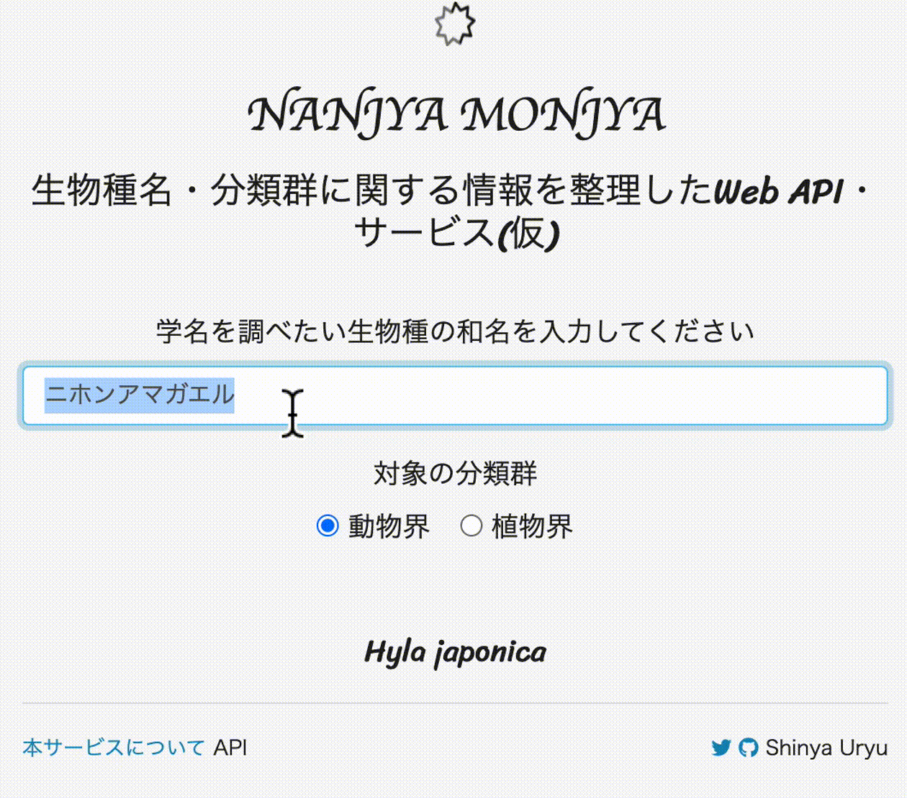

Nanjya Monjya
=================



生物種名・分類群に関する情報を整理したWeb API・サービス(仮)

https://uribo.shinyapps.io/nmnj/

で試せます。

対象の生物分類群（現在は `動物界`、`植物界`にのみ対応。将来的に`菌界`を追加予定）を選択したのち、フォームに生物名を入力してください。データ上に一致する和名が見つかった場合、学名が出力されます。

## ローカル環境で実行する

Rを使ってアプリケーションを起動できます。ただし生物名のデータはサンプルとして用意したものとなります。

以下のコマンドをRで実行してください。

```r
shiny::runGitHub("uribo/nmnj-app")
```

## API

**準備中**
